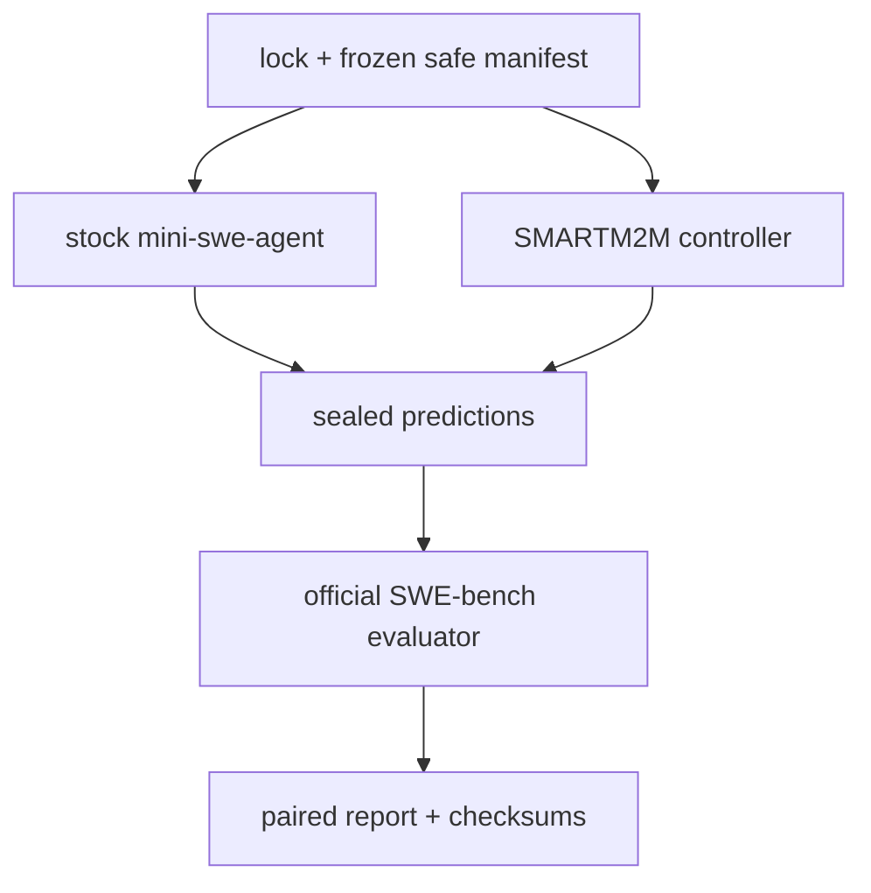

# Track 3 design

## Architecture

The repository has one locked experiment runner and two isolated arms.

The reference arm is launched as an external `mini-extra swebench` process.
Only configuration overlays set the common model, endpoint, decoding values,
step cap, task filter, output path, and timeout. The custom arm uses the same
OpenAI-compatible model route and exposes a small typed tool surface:
repository listing/search/read, source-only unified patching, bounded test
execution, diff inspection, rollback, and patch submission.

Each task starts from its recorded base commit. The official SWE-bench x86_64
image is attached to the custom test/validation commands, so the custom arm
does not silently test against the host when an image is declared. Source
inspection and Git patch operations stay on the disposable checkout. The
reference remains responsible for its own official container lifecycle.

## Intervention rationale

The measured change is a reliability controller around the same model, not a
larger prompt or another model. It adds evidence and recovery that the
assignment specifically requests:

- inspect before editing and keep edits source-only;
- require an observed zero-return-code test after the latest patch;
- checkpoint before edits and roll back once after build failures;
- detect repeated action/workspace states and permit one strategy reset;
- bind the sealed patch to its latest successful test and a clean-base replay;
- record all command output, return codes, timeouts, patch hashes, and usage.

The agent can choose a targeted repository-native test command for debugging,
but command validation rejects shell composition, expansion, traversal, and
non-test/system-management entry points. Official resolution is never inferred
from that visible test; it comes only from the evaluator after predictions are
sealed.

## Data and contamination boundary

The pinned dataset is used twice with separate responsibilities. Hydration
copies only instance ID, issue text, repository/base identity, image, and safe
test profile into `tasks/evaluation.json`. Gold `patch`, `test_patch`,
`hints_text`, `FAIL_TO_PASS`, and `PASS_TO_PASS` are not accepted by
`TaskSpec.from_mapping` and are recursively checked out of the generation
projection. The evaluator receives the hidden dataset data only after both
prediction files are sealed.

The eight IDs are selected from all 50 pool IDs using a fixed seed before any
agent run. Failures cannot trigger reselection. After sealing, trajectories are
reviewed for evidence-driven debugging versus suspicious exact solution
knowledge; suspicious tasks remain in the headline denominator.

## Reproducibility and budget

The lock records the dataset revision, selection fingerprint, model, endpoint,
seed, temperature, completion-token limit, turn/step limit, wall policy,
mini-swe-agent commit, evaluator commit, and one-attempt protocol. DeepInfra
pricing is not hard-coded because an unset or changing provider price would
make a nominal dollar cap false. Both arms therefore use the matched 60-step/
turn and 8,192-token-call caps; token usage and known cost are reported
separately.

## Limitations and next steps

The Work environment used for this audit has no Docker daemon and no provider
credential, so it cannot produce a valid primary score. The exact command and
manual prerequisites are recorded in `MANUAL_ACTIONS.md`. A compatible
x86_64 Docker host should run the primary command, preserve the complete
bundle, and then receive a human contamination review. The hosted API may not
honor seed determinism; no stronger claim is made.

No web UI, database, vector retrieval, multi-agent orchestration, model
training, alternate provider, repeated-attempt aggregation, Track 1, or Track
2 work was included.
