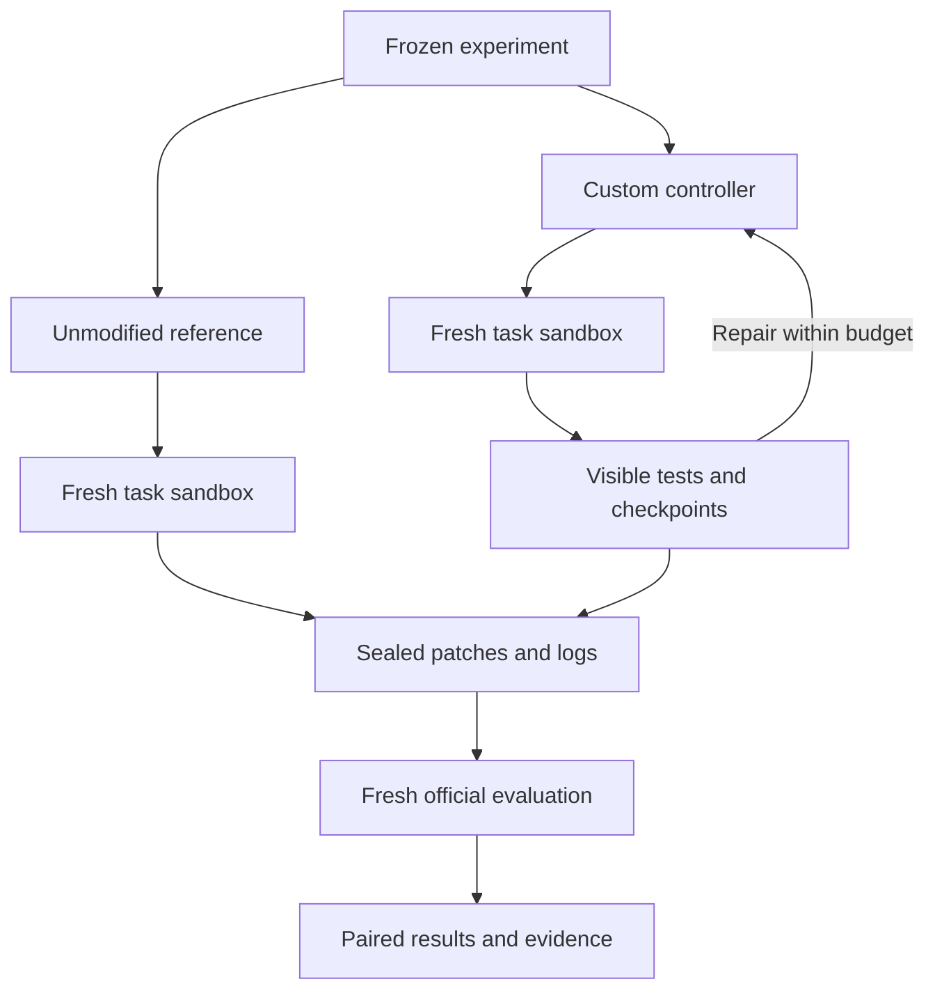

# Track 3 design

Updated: 2026-09-12. **Proposed design; implementation and measurements are pending.** Replace proposed behavior with verified behavior before submission.

## Problem and objective

An LLM can produce a plausible patch that does not fix a bug or breaks existing behavior. This project will test whether a small controller improves an unchanged model's success over the assignment's reference agent. The primary result is the percentage-point difference in official resolved rate on the complete fixed task list, under matched budgets.

## Architecture

The experiment supervisor owns configuration, task allocation, the model credential, lifecycle limits, and artifact collection. Task containers expose only the issue and base repository. The evaluator alone receives gold test material after both arms' patches are sealed. It never sends its output back into the scored generation session.

The baseline uses pinned mini-swe-agent code and shipped SWE-bench prompts. Only documented model, endpoint, budget, environment, and output settings change. The custom controller can share the same transport and environment interfaces while implementing its own control flow. Common environment restrictions apply equally to both arms.

## Custom behavior

The agent will locate relevant files, formulate a small reproduction from the issue, edit source, and run available repository tests. The controller records the actual command, exit status, collected-test count where available, and complete output. An assertion by the model that tests passed cannot satisfy validation.

Before submitting, reconstruct the exact candidate patch in a fresh base workspace and rerun the chosen visible checks. Associate the result with the patch hash and test-command hash. If the patch changes, invalidate that validation. A reproduction that was never observed failing before the fix is recorded as weaker evidence.

Checkpoint before edits. Detect repeated command/output/workspace states and patch oscillation. On syntax/import breakage or a newly introduced visible regression, restore the prior checkpoint, explain the observed failure, and allow a bounded repair within the original budget. If repair fails, produce an explicit failure record; retain attempted diffs for audit.

Visible checks guide the custom agent. Only the official evaluator determines benchmark resolution. Test selection based on issue text and base-repository files is permitted; using withheld test names, gold patches, or prior solution traces for generation is excluded.

## Key tradeoffs

| Choice | Benefit | Cost or limitation |
|---|---|---|
| Sequential Python controller | Small implementation; explicit state and accounting. | Less search breadth than a large agent system. |
| Shared stock model transport | Fewer provider differences in the comparison. | Must inspect retries, dropped parameters, and price registration. |
| Direct test gating and rollback | Addresses concrete build failures and unsupported completion claims. | Uses time within the same episode budget. |
| Existing x86_64 machine with Docker | No always-on service; conventional evaluation path. | Image storage and historical dependencies can dominate setup. |
| One model and one primary attempt per task | Affordable, interpretable paired comparison. | Eight tasks and one attempt give limited statistical precision. |
| Official tests only after generation freeze | Reduces evaluation leakage. | Hidden failures cannot guide the primary run's repairs. |

## Limitations and next steps

No improvement is guaranteed. Modern reference prompts already encourage reproduction and testing, so the custom agent must demonstrate a benefit from enforced validation and recovery. A small public benchmark can be memorized, and a hosted model identifier does not prove immutable backend weights. Same seeds do not guarantee bit-for-bit hosted outputs.

Complete the task manifest and compatibility checks, implement the minimal end-to-end path, then test recovery on synthetic/development bugs. Freeze the experiment before the scored comparison. Report losses, infrastructure failures, suspected contamination, scope cuts, and actual time alongside gains. Add paired repetitions and development ablations only if the core evidence is complete and budget remains.

Detailed contracts are in the [plan](IMPLEMENTATION_PLAN.md), [evaluation protocol](docs/evaluation-protocol.md), and [security/contamination policy](docs/security-and-contamination.md).
